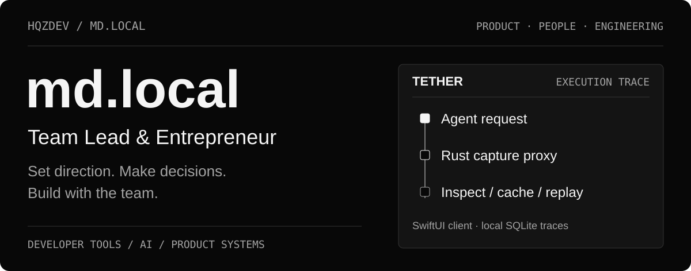
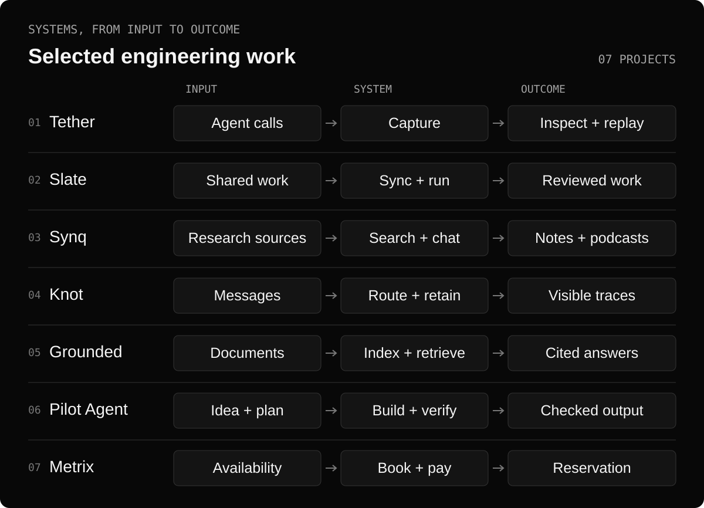
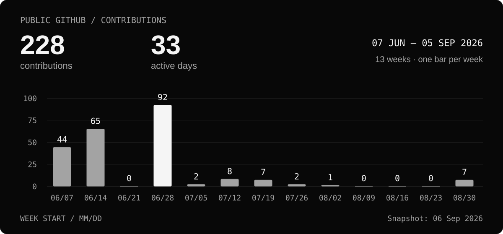
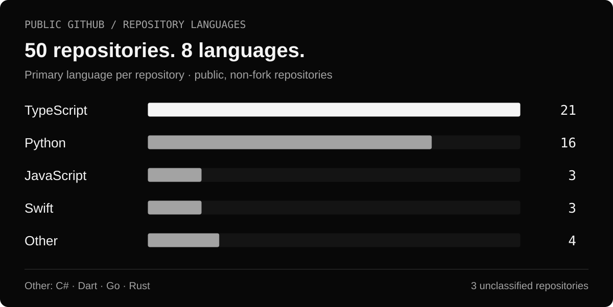
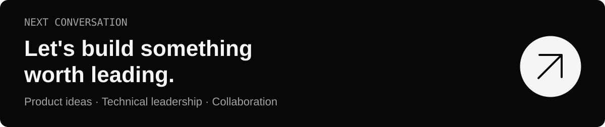

  

  <a href="#how-i-lead">Leadership</a> ·
  <a href="#selected-work">Selected work</a> ·
  <a href="#engineering-stack">Stack</a> ·
  <a href="#github-snapshot">Activity</a> ·
  <a href="#contact">Contact</a>

**I'm md.local — a team lead and entrepreneur with a hands-on engineering background.** I connect product direction with technical execution: choosing what to build, making architecture decisions and helping a team turn a plan into working software.

My interests are developer tools, AI systems and products that make complex work easier. I care about a clear problem, a focused first version and an engineering foundation the team can keep improving.

## How I lead

| Responsibility | My approach |
| --- | --- |
| **Product direction** | Start with the user and the problem. Define the first useful version, priorities and what success should look like. |
| **Technical leadership** | Make trade-offs explicit. Set system boundaries, document decisions and keep architecture understandable. |
| **Team execution** | Break work into owned, reviewable pieces. Make dependencies visible, resolve blockers and keep the team aligned on the next milestone. |
| **Quality and delivery** | Agree on acceptance criteria early. Use code review, automated checks and operational feedback to guide releases. |
| **Entrepreneurship** | Connect product scope, technical cost and business value. Test assumptions and adjust the roadmap as evidence changes. |

## Selected work

A selection of systems that show how I approach architecture, developer experience and product delivery.

| Project | Product | Engineering focus |
| --- | --- | --- |
| **[Tether](https://github.com/Hqzdev/Tether)** | A local-first command center for debugging AI agents, with a native macOS app and a shared Rust proxy. | Request capture, trace inspection, caching and replay. |
| **[Slate](https://github.com/Hqzdev/Slate)** | A collaborative workspace for code, notes, architecture diagrams and execution. | Real-time synchronization, reviewable AI drafts and container-based runs. |
| **[Synq](https://github.com/Hqzdev/synq)** | A self-hosted research workspace for documents, websites, audio, video and notes. | Hybrid search, source-grounded chat, background processing and multi-speaker podcasts. |
| **[Knot](https://github.com/Hqzdev/Knot)** | An experimental messenger and privacy anti-pattern exhibit that makes message retention and exposure visible. | Go services, gRPC routing, event-driven delivery, presence and message tracing. |
| **[Grounded](https://github.com/Hqzdev/Grounded)** | A workspace for asking questions over documents and inspecting the supporting sources. | Asynchronous indexing, tenant-scoped retrieval and persisted citations. |
| **[Pilot Agent](https://github.com/Hqzdev/pilot-agent)** | A terminal agent for moving from an idea through planning, implementation and verification. | Resumable state, interchangeable providers, execution backends and acceptance checks. |
| **[Metrix](https://github.com/Hqzdev/Metrix)** | A booking platform for coworking spaces, offices and meeting rooms, currently in development. | Booking and payment workflows, event processing and shared service contracts. |

<strong>Inside the systems — architecture and implementation</strong>

### Tether · making agent execution inspectable

A SwiftUI macOS client sits on top of a Rust proxy with local SQLite storage. Requests can be captured, inspected and replayed when their bodies have been retained. Editing a node's output marks downstream spans as stale; a separate cache stores reusable responses.

**Technical choices:** native interface, shared backend, explicit replay state and local trace storage. The repository also includes a Linux alpha; Windows support remains planned.

### Slate · collaboration with review boundaries

Yjs and a dedicated WebSocket service synchronize code, notes and canvas state. Room persistence writes the canonical document and collaboration snapshot together. AI document changes are proposed as drafts and checked against current content before application.

A separate BullMQ worker handles execution, including Docker runs with resource limits. Tests cover retries, duplicate application and conflicts with collaborator edits.

**Technical choices:** Next.js, TypeScript, PostgreSQL, Yjs, Redis and Docker, with separate web, synchronization and execution processes.

### Synq · turning sources into a research workspace

Documents, websites, audio, video and notes feed a notebook workflow with hybrid search, source-grounded chat, transformations and podcast generation. FastAPI submits long-running work to a background worker; SurrealDB stores content, graph relationships, full-text indexes and vectors.

LangGraph and a provider registry connect language, embedding and speech models. Local inference is available through configured local providers, while hosted models remain optional.

**Technical choices:** Next.js, TypeScript, Python / FastAPI, SurrealDB, LangGraph and asynchronous commands.

### Knot · making message behavior visible

Knot Unsecure is an intentionally exposed messaging experiment. Its interface shows how drafts, edits, deleted originals and attachments remain visible across the system, making privacy failure modes part of the product itself.

Message commands pass through Gateway, Router and Delivery services using WebSockets and gRPC. PostgreSQL retains message records; NATS JetStream carries events, Redis handles presence and drafts, and MinIO stores attachments. The browser controller coordinates the outbox, reconnection and catch-up.

**Technical choices:** Go, Next.js, TypeScript, gRPC / Protobuf, NATS JetStream, PostgreSQL, Redis and MinIO.

### Grounded · answers with inspectable evidence

A Rust gateway connects the web application to Python services. Ingestion queues work through RabbitMQ; an embedding worker indexes document chunks in Qdrant. Retrieval is scoped to a tenant, refuses requests without evidence and stores citations alongside answers.

The default local path uses deterministic embeddings and extractive answers. An ingestion-to-retrieval smoke script covers registration, document indexing, reindexing and a cited response.

**Technical choices:** Next.js, Rust / Axum, Python / FastAPI, PostgreSQL, Qdrant, RabbitMQ and MinIO.

### Pilot Agent · progress that survives a session

Project state, plans and tool artifacts persist on disk. Provider adapters share a conversation model, while local and Docker backends separate execution from orchestration. Acceptance checks make verification part of the workflow.

Iteration budgets, session locking and explicit provider error handling bound and explain runtime behavior.

**Technical choices:** Python, provider and execution abstractions, inspectable Markdown state and pytest coverage.

### Metrix · coordinating a booking lifecycle

Booking, payment, calendar and notification services share contracts and operational packages. The architecture uses Redis Streams and BullMQ for asynchronous work, with idempotency, slot locking and compensation paths around booking and payment state.

**Technical choices:** TypeScript, Next.js, PostgreSQL, Prisma, Redis, Docker and OpenTelemetry. [Project website](https://metrixplatform.vercel.app).

## Engineering stack

Tools used across the projects above.

| Area | Technologies |
| --- | --- |
| **Languages** | TypeScript · Python · Rust · Swift · Go |
| **Interfaces** | Next.js · React · SwiftUI · Monaco · Yjs |
| **Services** | Node.js · FastAPI · Axum · REST / OpenAPI · WebSockets · gRPC / Protobuf |
| **Data and retrieval** | PostgreSQL · SQLite · SurrealDB · Prisma · Qdrant · MinIO |
| **Asynchronous work** | Redis · Redis Streams · BullMQ · RabbitMQ · NATS JetStream |
| **AI systems** | Provider adapters · LangGraph · agent orchestration · retrieval pipelines · trace capture and replay |
| **Delivery and operations** | Docker · GitHub Actions · pytest · OpenTelemetry · Prometheus · Grafana |

## GitHub snapshot

**228 contributions across 33 active days**, from **7 June to 5 September 2026**. Weekly totals follow GitHub's contribution definitions and come from the publicly visible calendar.

**50 public repositories · 8 detected primary languages.** TypeScript: 21 repositories; Python: 16; JavaScript: 3; Swift: 3; other languages: 4. The Other group contains C#, Dart, Go and Rust; three repositories are unclassified.

Static snapshot captured 6 September 2026. Language counts describe repositories, not proficiency. [Data and sources](assets/readme/github-snapshot.json) · [Visual notes](assets/readme/README.md)

## Contact

Open to conversations about **technical leadership, product ventures and collaboration**.

  <a href="https://github.com/Hqzdev">GitHub</a> ·
  <a href="https://t.me/Osaslime">Telegram</a> ·
  <a href="https://discord.com/users/1268562577080713282">Discord</a>

